# [godot-template](https://github.com/Hulvdan/godot-template)

## Setting Up The Machine

- Download godot source to ..\godot-4.6-stable
- Inside of it execute:
  ```
  python misc\scripts\install_d3d12_sdk_windows.py
  ```
- Make godot.exe, godot_console.exe accessible
  ```
  mklink c:\Users\user\Programs\PATH\godot.exe c:\Users\user\Programs\godot\Godot_v4.6-stable_win64.exe
  mklink c:\Users\user\Programs\PATH\godot_console.exe c:\Users\user\Programs\godot\Godot_v4.6-stable_win64_console.exe
  ```
- Download buf and place it into PATH
  https://github.com/bufbuild/buf/releases/tag/v1.65.0
- Download and put in PATH
  https://github.com/GDQuest/GDScript-formatter/releases
- (for stylua pre-commit) Install rust
  https://rust-lang.org/tools/install/
- (for proto)
  ```
  go install github.com/mariomakdis/proto-renumber@v1.1.0
  ```

## Bootstrap A New Repo

```
# * Create a repo in GitHub
# * Clone it
git remote add template https://github.com/hulvdan/godot-template.git
git fetch template
git merge template
git push
uv sync
uv run pre-commit install
uv run pre-commit install --install-hooks
# * Open Godot -> Project Settings -> Change name
```

<!-- [[[cog
from pathlib import Path
for filepath in sorted(Path("docs").glob("*.png"), key=lambda x: -int(x.stem)):
  print(f"")
cog]]] -->
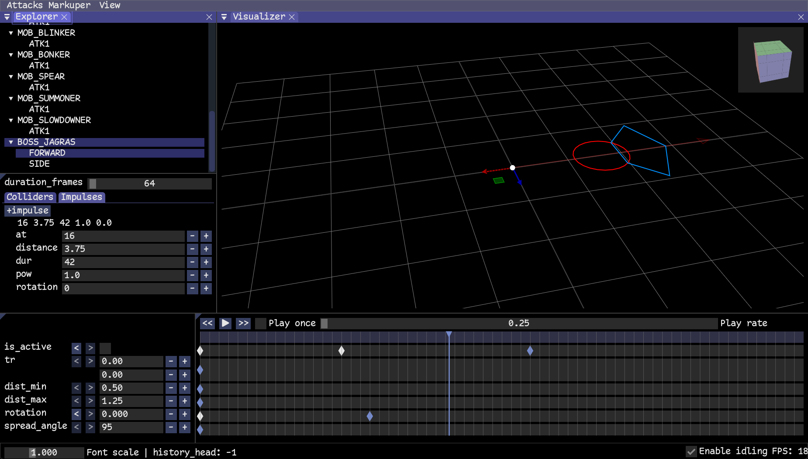
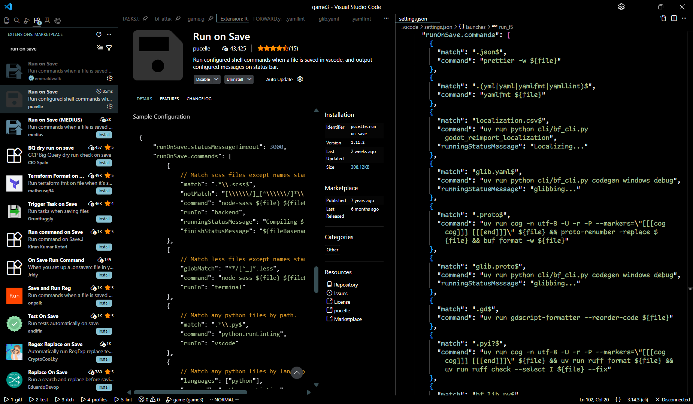
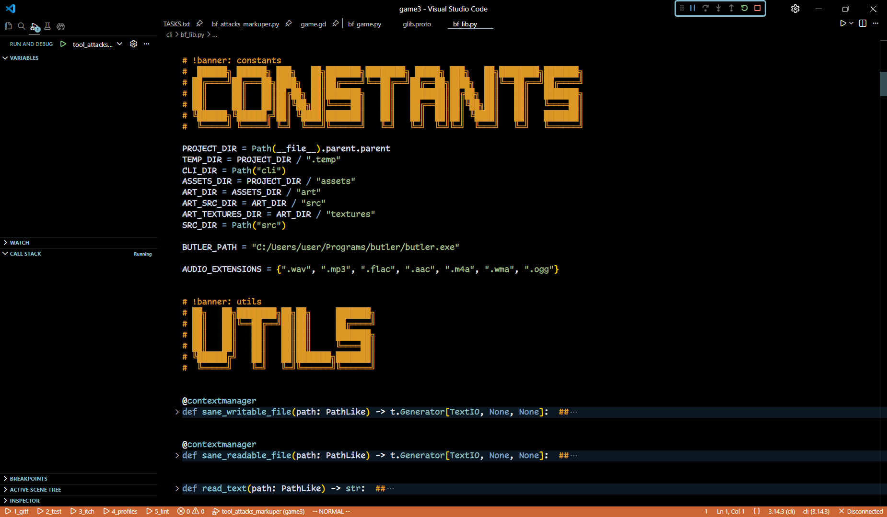
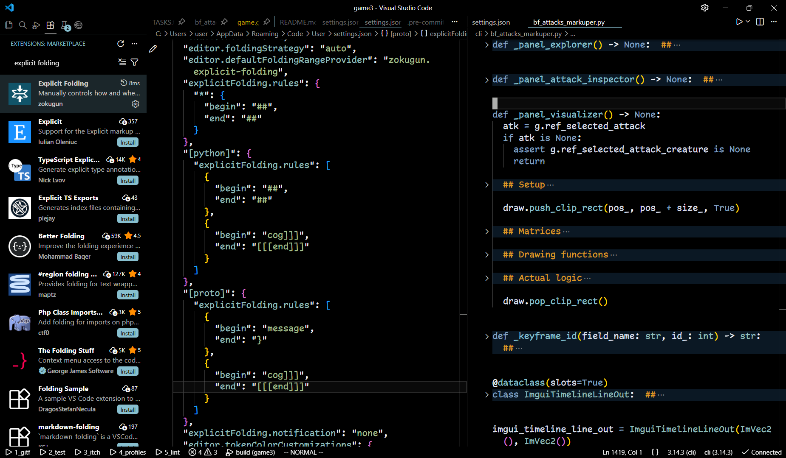
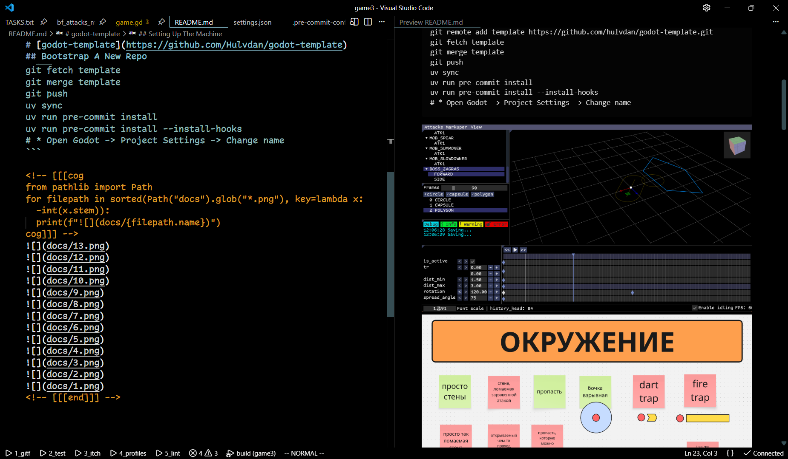
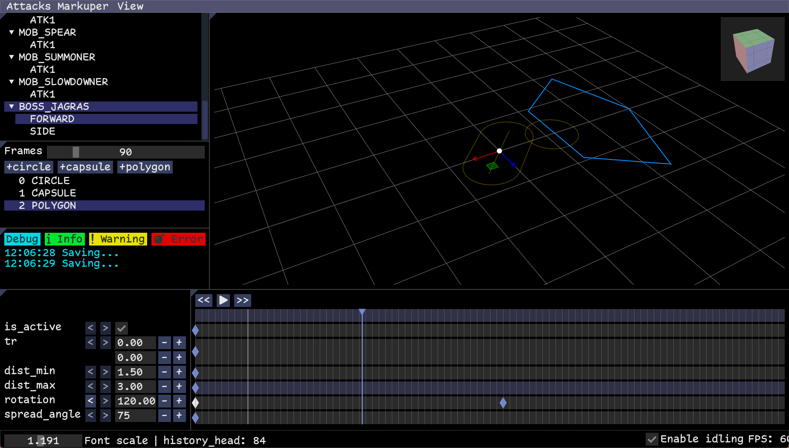
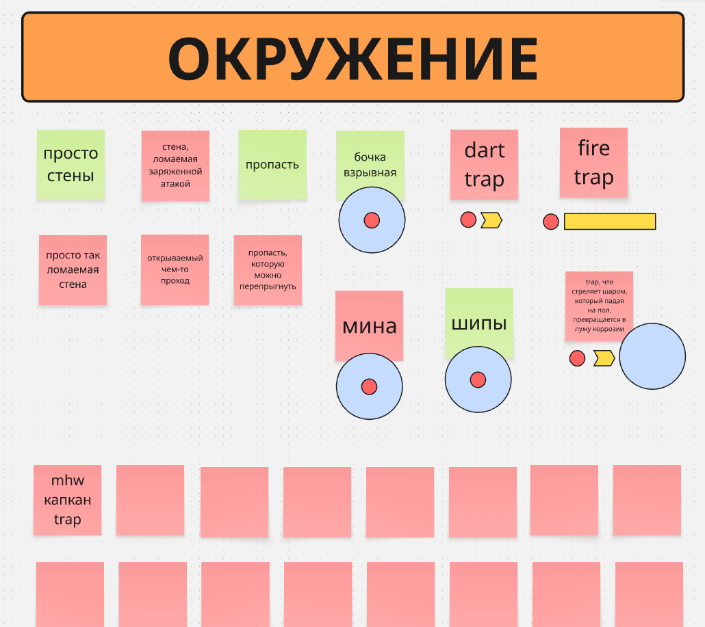

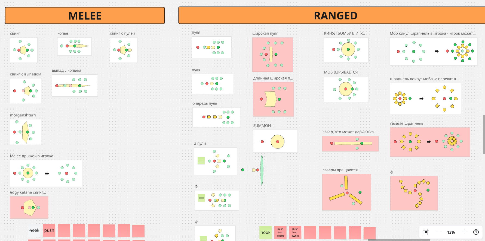
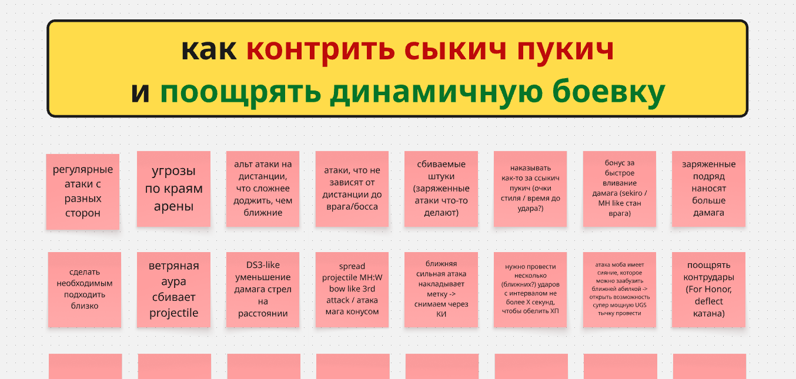

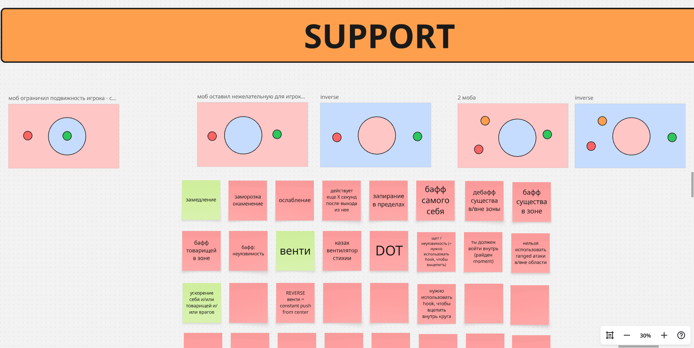


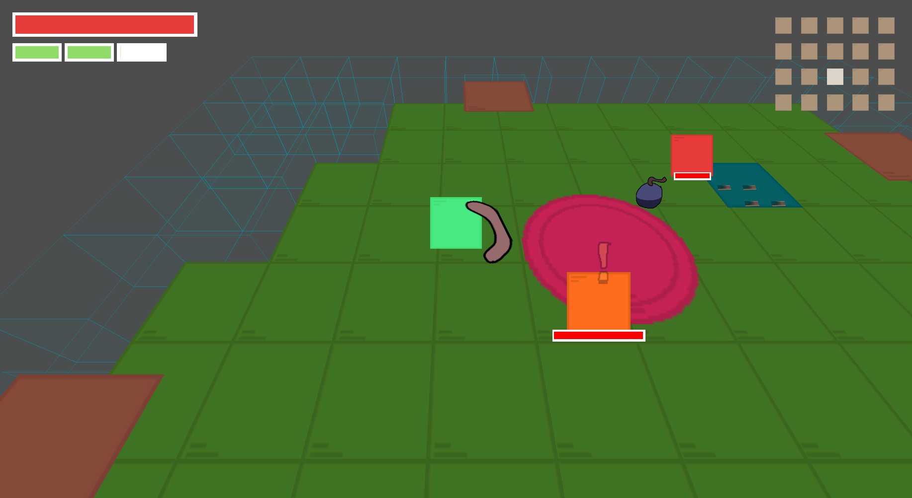
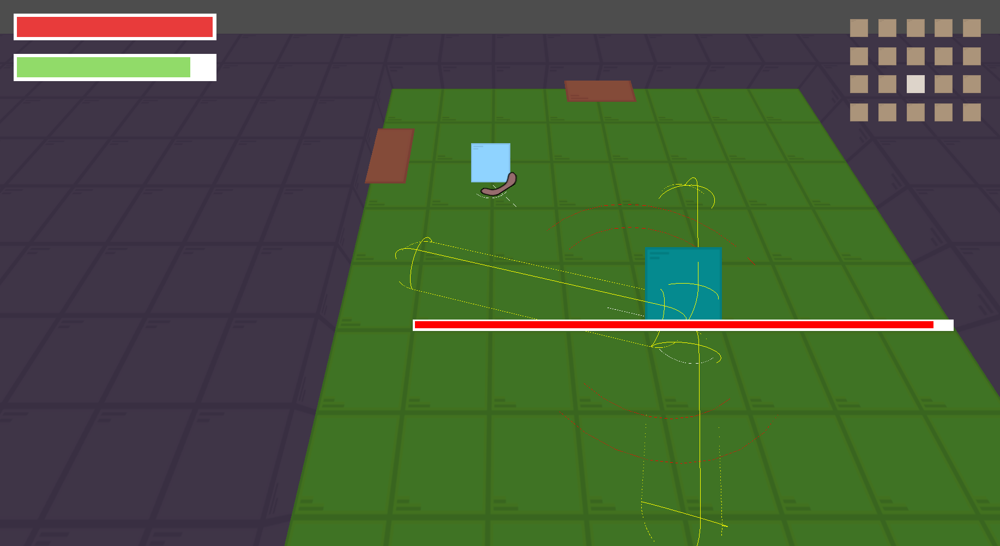
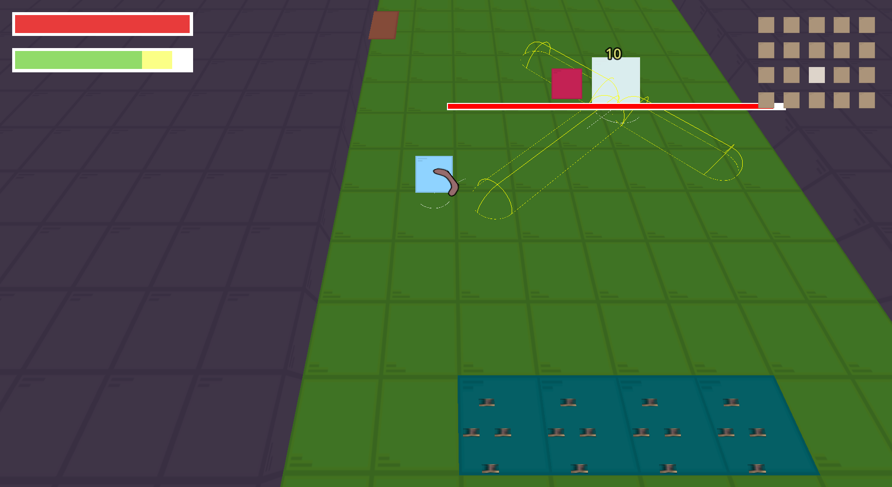
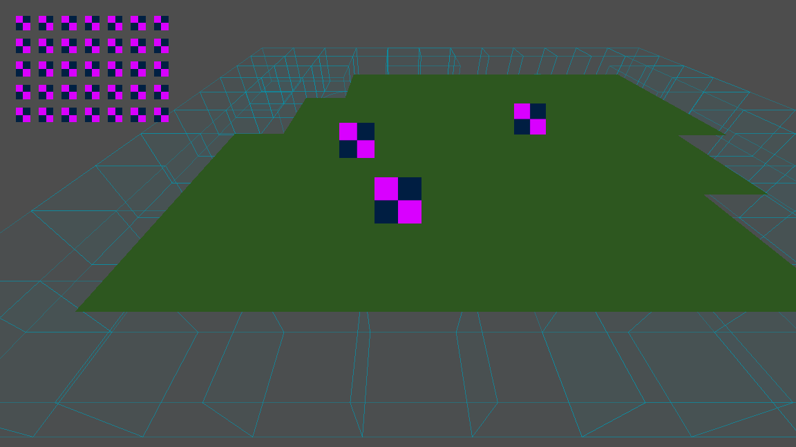
<!-- [[[end]]] -->
